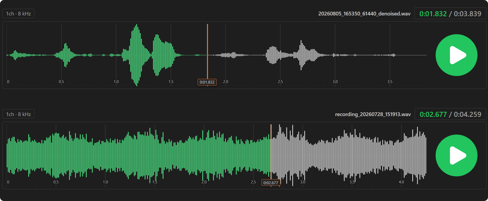

# Audio Player

A VS Code extension that opens audio files (wav / mp3 / ogg / flac / m4a / aac / webm / opus / mp4) directly in an editor tab — rendering an interactive waveform and playing them in-place.



## Features

- **Waveform visualization** — rendered with WaveSurfer.js; bar style, normalized peaks.
- **Multi-track compare** — right-click any audio file in the Explorer → *Add to Audio Player* to overlay more tracks in the same panel.
- **Time grid** — adaptive tick marks and labels drawn behind the waveform.
- **Playback control** — SVG play button; click the waveform to mark a start point and play from there.
- **Live hints** — hover line + time tooltip; click to drop a marker line with a bottom time tag.
- **Resize** — drag the bottom edge of a track to change its waveform height.
- **Track info** — channel count and sample-rate badge, plus current-time / duration badge.
- **Synced playback** — multiple tracks follow the first track as the clock source.
- **Localized** — ships English and Simplified Chinese, following `vscode.env.language`.
- **Theme-aware** — green accent that adapts to light / dark / high-contrast themes.

## Usage

1. Double-click an audio file in the Explorer to open it with Audio Player.
2. Right-click other audio files → *Add to Audio Player* to add more tracks.
3. Click the waveform to set a start point, then click the play button to play from it.

## Build

```bash
npm install
npm run build      # production bundle to dist/
npm run package    # build + package a .vsix
```

## License

MIT
